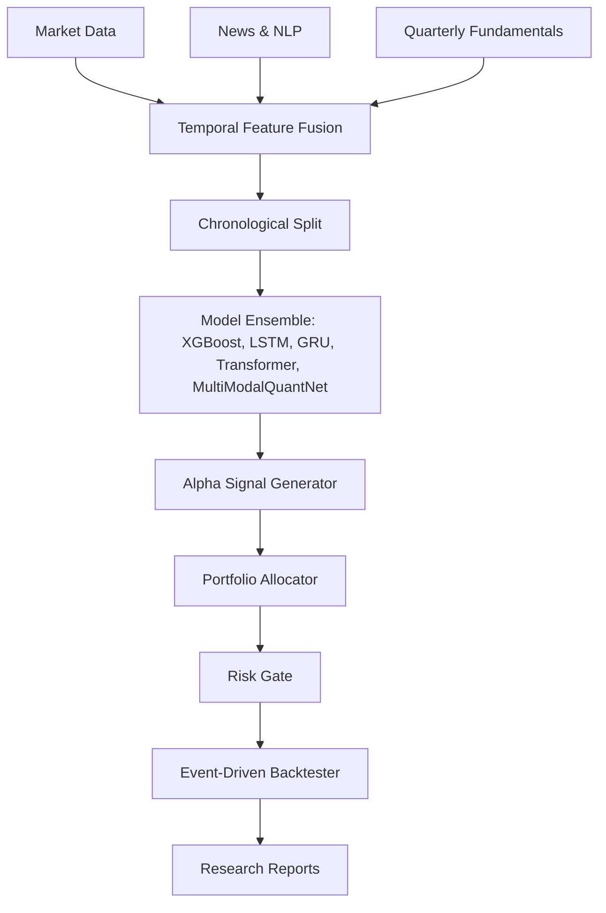

# System Architecture

## Overview
The QUANT AI Platform is an end-to-end multi-modal quantitative finance research system combining Market OHLCV, Financial News NLP sentiment, and Fundamental Financial Statements.

